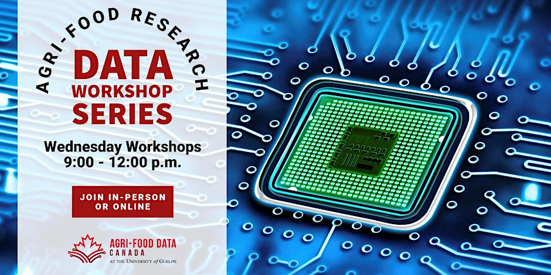

# Agri-food Research Data Workshop Series
Hosted by Agri-Food Data Canada at the University of Guelph

## Summer 2023

### 1. Registration
Click [here](https://www.eventbrite.ca/e/agri-food-research-data-workshop-series-tickets-600860870037) to register for FREE for the Summer 2023 Workshop Series

### 2. Location

- **In-person**: University of Guelph, Animal Biosciences Building, Room ANNU 102, Guelph, ON N1G 2W1
- **Online**: MS Teams link sent upon registration

### 3. Schedule
**Workshop 1: The Data Life Cycle and your Role as a Researcher (April 12)**

Click [here](2023-Summer/1%20-%20The%20Data%20Life%20Cycle%20and%20your%20role%20as%20a%20researcher/AgriFoodDataWorkshop_20230412.pdf) for the slide notes

1. The beginnings of data management
2. Review the data life cycle

**Workshop 2: Data Management Plans (April 19)**

Click [here](2023-Summer/2%20-%20Data%20Management%20Plans/AgriFoodDataWorkshop_20230419.pdf) for the slide notes

1. What are DMPs?
2. How do you use DMPs?

**Workshop 3: New Ontario Dairy Research Centre Data Portal (April 26)**

Click [here](2023-Summer/3%20-%20New%20ODRC%20Data%20Portal/AgriFoodDataWorkshop_20230426.pdf) for the slide notes

1. Learn about the Ontario Dairy Research Centre Portal and what is available to access

**Workshop 4: Documenting your Data (May 3)**

Click [here](2023-Summer/4%20-%20Documenting%20Your%20Data/AgriFoodDataWorkshop_20230503.pdf) for the slide notes

1. Learn why it is important to document your data and different ways to do it

**Workshop 5: Introduction to R (May 10)**

Click [here](2023-Summer/5%20-%20Introduction%20to%20R/AgriFoodDataWorkshop_20230510.pdf) for the slide notes and [here](https://github.com/agrifooddatacanada/Research-Data-Workshop-Series/tree/main/2023-Summer/5%20-%20Introduction%20to%20R) for the workshop sample data

1. Learn about R and how to get started

**Workshop 6: Documenting your Data and Processes with R Markdown (May 24)**

Click [here](2023-Summer/6%20-%20Documenting%20with%20R%20Markdown/AgriFoodDataWorkshop_20230524.pdf) for the slide notes

1. Learn about R Markdown and how to get started
* Participants MUST have R experience or have attended the May 10 Introduction to R session

**Workshop 7: R Shiny (May 31)**

Click [here](2023-Summer/7%20-%20Introduction%20to%20Shiny/AgriFoodDataWorkshop_20230531.pdf) for the slide notes and [here](https://github.com/agrifooddatacanada/Research-Data-Workshop-Series/tree/main/2023-Summer/7%20-%20Introduction%20to%20Shiny) for the workshop sample script and data

1. Learn about R Shiny and how to get started
* Participants MUST have R experience or have attended the May 10 Introduction to R session

**Workshop 8: Introduction to GitHub (June 14)**
1. Learn about GitHub and how to get started

**Workshop 9: Introduction to Linux (June 21)**
1. Learn about Linux and how to get started
